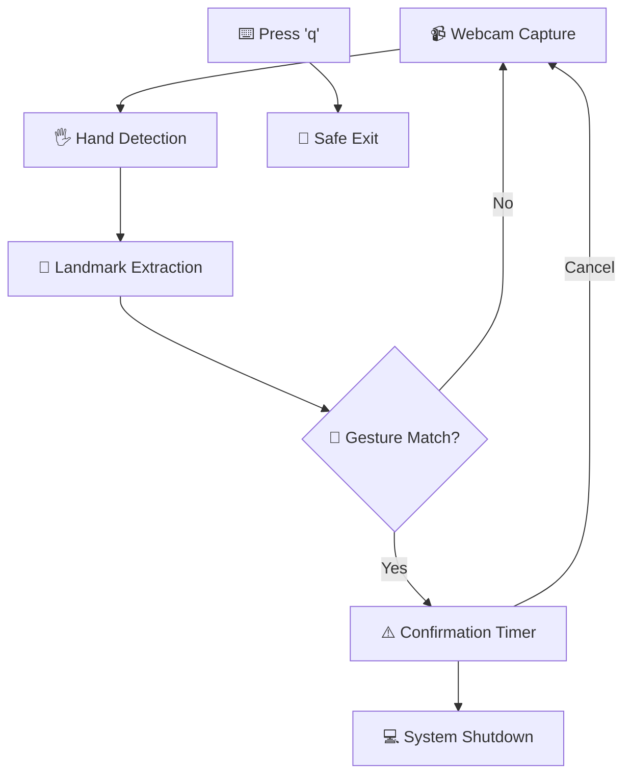

# 🖐 Hand-Gesture Shutdown for PC (Python)

<div align="center">


**Control your PC's power with a simple hand gesture.**  
No more clicking Start → Power → Shutdown. Just raise your hand (literally) and your system shuts down in style.

</div>

---

## 🎯 Overview

This project uses **MediaPipe** for real-time hand tracking combined with **OpenCV** to detect a specific gesture via your webcam. When the gesture is recognized, a shutdown command is sent to the operating system.

💡 *Think of it as a futuristic kill switch — but with style and zero extra hardware.*

Perfect for:
- 🎮 Gamers who want a quick way to shutdown during streaming
- 👨‍💻 Developers working on touchless interfaces
- 🔬 Anyone exploring computer vision applications
- 🚀 Tech enthusiasts who love sci-fi level control

---

## ✨ Features

<div align="center">

| Feature | Description | Status |
|---------|-------------|--------|
| 🎯 **Gesture-based Shutdown** | Trigger system shutdown when specific gesture is detected | ✅ Active |
| 📷 **Real-time Camera Tracking** | Uses webcam for instant gesture recognition | ✅ Active |
| 💻 **Cross-platform Support** | Works on Windows, macOS, and Linux | ✅ Active |
| ⚡ **Lightweight Performance** | Minimal dependencies, fast execution | ✅ Active |
| 🛑 **Safety Control** | Press `q` to quit safely without shutting down | ✅ Active |
| 🔧 **Customizable Gestures** | Easy to modify gesture patterns | 🔄 Configurable |

</div>

---

## 🛠️ Technology Stack

<div align="center">

| Technology | Purpose | Version |
|------------|---------|---------|
| **Python** | Core programming language | 3.8+ |
| **OpenCV** | Camera input & image processing | Latest |
| **MediaPipe** | Hand landmark detection & tracking | Latest |
| **OS Module** | System shutdown command execution | Built-in |

</div>

---

## 📂 Project Structure

```
COMING SOON !!
shutdown_PC_with_hand_python/
│
├── 📄 Project.py           # Main application
├── 📋 requirements.txt     # Python dependencies
├── 📖 README.md           # Project documentation
├── 📁 assets/             # Demo images & videos
│   ├── 🖼️ demo_gesture.png
│   └── 🎬 demo_video.gif
└── 📁 docs/               # Additional documentation
    └── 📝 troubleshooting.md
```

---

## 🚀 Quick Start Guide

### Prerequisites

- Python 3.8 or higher
- Webcam/Camera access
- Administrator privileges (for shutdown commands)

### Installation Steps

#### 1️⃣ **Clone the Repository**
```bash
git clone https://github.com/arizzira/shutdown_PC_with_hand_python.git
cd shutdown_PC_with_hand_python
```

#### 2️⃣ **Set Up Virtual Environment** (Recommended)
```bash
# Windows
python -m venv venv
venv\Scripts\activate

# macOS / Linux
python3 -m venv venv
source venv/bin/activate
```

#### 3️⃣ **Install Dependencies**
```bash
# Install required packages
pip install opencv-python mediapipe

# Or install from requirements.txt
pip install -r requirements.txt
```

#### 4️⃣ **Test Camera Access**
```bash
# Run a quick camera test first
python -c "import cv2; cap = cv2.VideoCapture(0); print('Camera OK' if cap.read()[0] else 'Camera Error'); cap.release()"
```

#### 5️⃣ **Launch the Application**
```bash
python Project.py
```

---

## 🔄 How It Works

<div align="center">



</div>

### Detailed Process:

1. **📹 Video Input Capture**
   - OpenCV connects to your default webcam (index 0)
   - Streams real-time frames at optimal resolution

2. **🖐️ Hand Landmark Detection**
   - MediaPipe identifies 21 hand key points
   - Tracks fingertips, joints, and palm center coordinates

3. **🎯 Gesture Recognition**
   - Analyzes finger positions and orientations
   - Compares against predefined gesture pattern
   - Example gesture: Middle finger raised, others folded

4. **⚠️ Safety Confirmation**
   - Optional countdown timer before execution
   - Visual feedback on screen

5. **💻 Command Execution**
   - **Windows**: `shutdown /s /t 1`
   - **Linux**: `sudo shutdown now`
   - **macOS**: `sudo shutdown -h now`

---

## 🖐️ Gesture Configuration

### Default Gesture: "Stop" Hand
- **Palm**: Facing camera
- **Fingers**: All extended and separated
- **Duration**: Hold for 3 seconds
- **Distance**: 1-3 feet from camera

### Customizing Gestures

Edit the gesture detection logic in `Project.py`:

```python
def detect_shutdown_gesture(landmarks):
    # Example: Detect thumbs up
    thumb_tip = landmarks[4]
    thumb_mcp = landmarks[2]
    
    # Add your custom gesture logic here
    if thumb_tip.y < thumb_mcp.y:  # Thumb pointing up
        return True
    return False
```

---

## ⚠️ Safety & Important Warnings

<div align="center">

| ⚠️ **CRITICAL SAFETY NOTICES** |
|---|

</div>

- 🚨 **Instant Shutdown**: Once gesture is detected, shutdown happens **immediately**
- 💾 **Save Your Work**: Always save important files before testing
- 🧪 **Test Mode**: Comment out shutdown command during development
- 👤 **Admin Rights**: Linux/macOS require sudo privileges
- 📷 **Camera Privacy**: Ensure you're comfortable with camera access

### Safe Testing Method:
```python
# Replace shutdown command with print statement for testing
# os.system("shutdown /s /t 1")  # Comment this out
print("SHUTDOWN TRIGGERED!")  # Use this instead
```

---

## 🔧 Configuration Options

### Camera Settings
```python
# In Project.py, modify these values:
CAMERA_INDEX = 0        # Change if using external webcam
FRAME_WIDTH = 640       # Adjust for performance
FRAME_HEIGHT = 480      # Adjust for performance
CONFIDENCE_THRESHOLD = 0.8  # Gesture detection sensitivity
```

### Gesture Sensitivity
```python
GESTURE_HOLD_TIME = 3.0    # Seconds to hold gesture
CONFIRMATION_DELAY = 5.0   # Countdown before shutdown
```

---

## 🐞 Troubleshooting Guide

<details>
<summary><strong>📷 Camera Issues</strong></summary>

**Problem**: Camera not detected or black screen

**Solutions**:
- Check if another application is using the webcam
- Try different camera indices (0, 1, 2, etc.)
- Verify camera permissions in system settings
- Test with: `python -c "import cv2; print(cv2.VideoCapture(0).read())"`

</details>

<details>
<summary><strong>🖐️ Gesture Recognition Problems</strong></summary>

**Problem**: Gestures not being recognized

**Solutions**:
- Ensure adequate lighting (avoid backlighting)
- Position hand 1-3 feet from camera
- Make gestures slow and deliberate
- Clean camera lens
- Adjust `CONFIDENCE_THRESHOLD` value

</details>

<details>
<summary><strong>💻 Shutdown Command Issues</strong></summary>

**Problem**: Shutdown command doesn't execute

**Solutions**:
- **Windows**: Run as Administrator
- **Linux/macOS**: Check sudo permissions
- **macOS**: Grant terminal full disk access in Privacy settings
- Test command manually in terminal first

</details>

<details>
<summary><strong>🐍 Python Environment Issues</strong></summary>

**Problem**: Import errors or module not found

**Solutions**:
```bash
# Reinstall packages
pip uninstall opencv-python mediapipe
pip install opencv-python mediapipe

# Check Python version
python --version  # Should be 3.8+

# Verify installations
python -c "import cv2, mediapipe; print('All imports successful')"
```

</details>

---

## 📊 Performance Metrics

| Metric | Typical Value | Optimization Tips |
|--------|---------------|------------------|
| **Frame Rate** | 30 FPS | Lower resolution for better performance |
| **Detection Latency** | <100ms | Ensure good lighting |
| **CPU Usage** | 15-25% | Close other camera applications |
| **Memory Usage** | 150-200MB | Normal for CV applications |

---

## 🎯 Advanced Features (Future Roadmap)

- [ ] **Multiple Gesture Support** - Different gestures for restart, sleep, etc.
- [ ] **Voice Confirmation** - Audio feedback before shutdown
- [ ] **Mobile App Control** - Smartphone companion app
- [ ] **Network Shutdown** - Control remote computers
- [ ] **Scheduled Gestures** - Time-based gesture activation
- [ ] **Biometric Security** - Face recognition for authorized users

---

## 🤝 Contributing

Contributions make the open source community amazing! Here's how you can contribute:

### How to Contribute

1. **🍴 Fork** the repository
2. **🌿 Create** a feature branch (`git checkout -b feature/AmazingFeature`)
3. **💾 Commit** your changes (`git commit -m 'Add some AmazingFeature'`)
4. **📤 Push** to the branch (`git push origin feature/AmazingFeature`)
5. **🔄 Open** a Pull Request

### Contribution Ideas

- 🎯 New gesture patterns
- 🔧 Performance optimizations
- 📱 Cross-platform compatibility
- 🧪 Better testing methods
- 📚 Documentation improvements
- 🎨 UI/UX enhancements

---

## 📄 License

```
MIT License

Copyright (c) 2025 arizzira

Permission is hereby granted, free of charge, to any person obtaining a copy
of this software and associated documentation files (the "Software"), to deal
in the Software without restriction, including without limitation the rights
to use, copy, modify, merge, publish, distribute, sublicense, and/or sell
copies of the Software, and to permit persons to whom the Software is
furnished to do so, subject to the following conditions:

The above copyright notice and this permission notice shall be included in all
copies or substantial portions of the Software.

THE SOFTWARE IS PROVIDED "AS IS", WITHOUT WARRANTY OF ANY KIND, EXPRESS OR
IMPLIED, INCLUDING BUT NOT LIMITED TO THE WARRANTIES OF MERCHANTABILITY,
FITNESS FOR A PARTICULAR PURPOSE AND NONINFRINGEMENT.
```

---

## 🙏 Acknowledgments

- **Google MediaPipe** team for the excellent hand tracking solution
- **OpenCV** community for computer vision tools
- **Python** community for the amazing ecosystem
- All beta testers who helped identify bugs and improvements

---

## 📞 Contact & Support
arizgg6@gmail.com
<div align="center">

**Made with ❤️ by [arizzira](https://github.com/arizzira)**

[](https://github.com/arizzira)
[](https://github.com/arizzira/shutdown_PC_with_hand_python/issues)
[](https://github.com/arizzira/shutdown_PC_with_hand_python/stargazers)

### 🆘 Need Help?

- 📋 **Issues**: [Report bugs or request features](https://github.com/arizzira/shutdown_PC_with_hand_python/issues)
- 💬 **Discussions**: [Community discussions and Q&A](https://github.com/arizzira/shutdown_PC_with_hand_python/discussions)
- 📧 **Email**: For private inquiries

</div>

---

<div align="center">

### ⚠️ **Use Responsibly** ⚠️
*This tool can shut down your computer instantly. Always save your work and test in a safe environment first.*

<sub>⭐ If this project saved you time (or accidentally shut down your computer), please give it a star! ⭐</sub>

</div>
